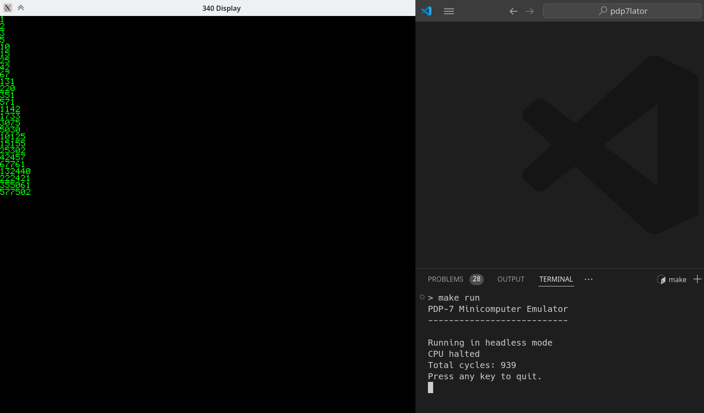

# Podepasete
An emulator of the historical PDP7 computer written in the C programming language.

## Requirements

This project is written in C and uses the SDL2 library for the `display.c` graphics. You can install the project requirements with the following command:

```bash
sudo apt-get install make libsdl2-dev
```

## Compilation

To compile the project, you can use the following command:

```bash
make
```

## Usage

The emulator is an interactive program that reads the PDP7 machine code from the standard input and executes it. You can run the emulator with the following command:

```bash
./bin/pdp7_emulator
```

For convenience, a sample program that prints the Fibonacci number (in octal) is provided in the `data` directory. You can run it with the following command:

```bash
make debug
```

Here is a sample screenshot of the expected output of the sample program:



## Tests

The project includes a test suite that can be run with the following command:

```bash
make test
```

## License

This project is licensed under the MIT License - see the [LICENSE](LICENSE) file for details.
